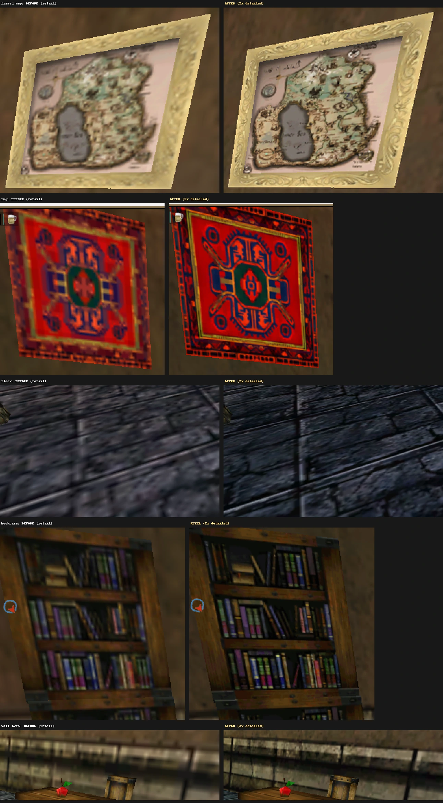
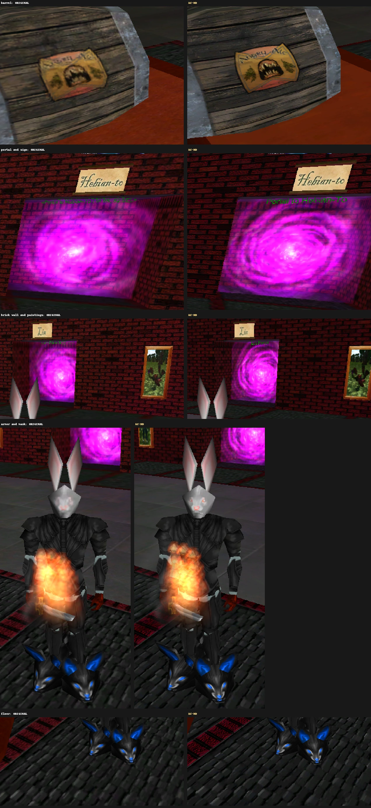
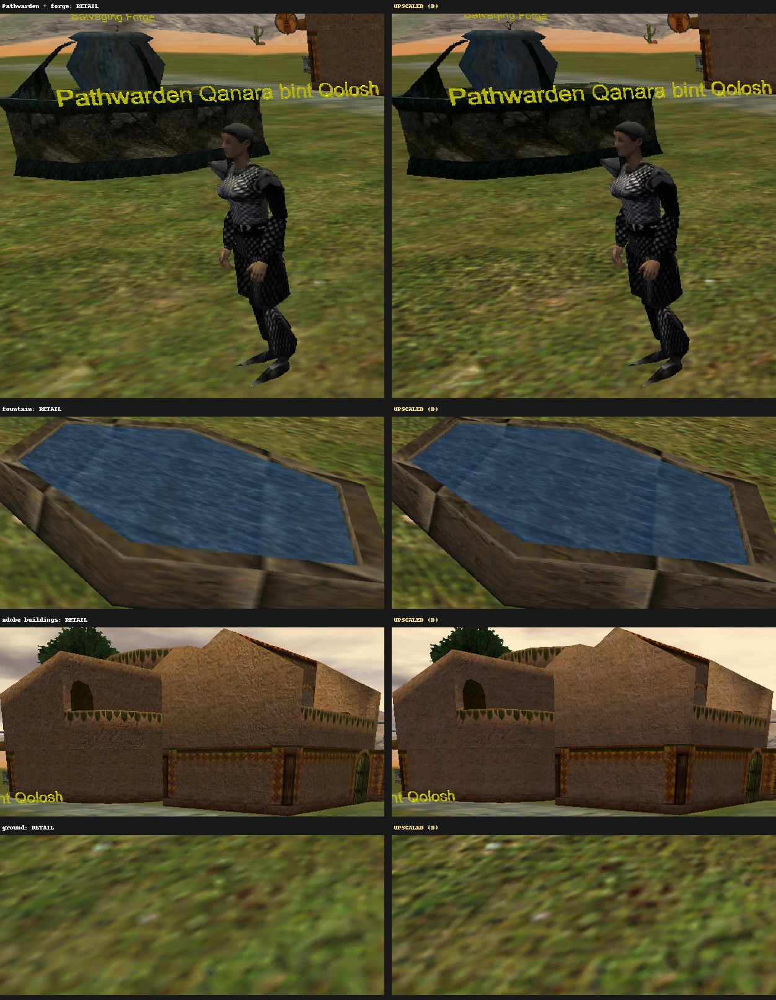
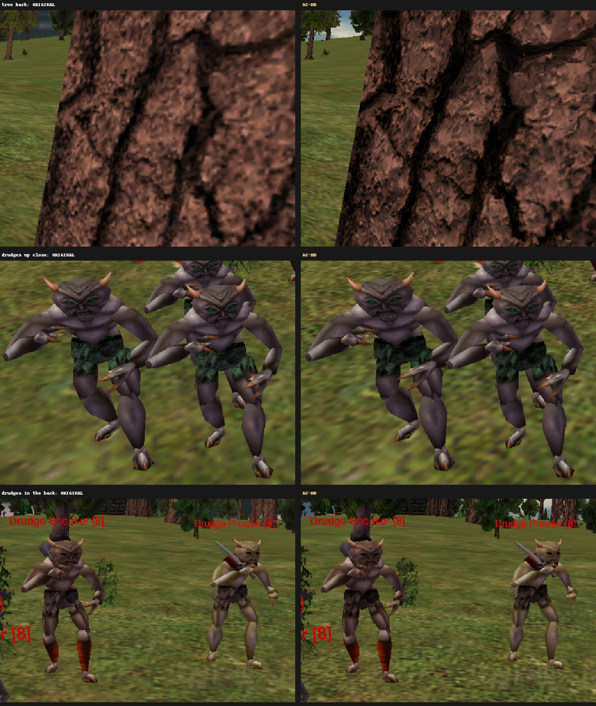
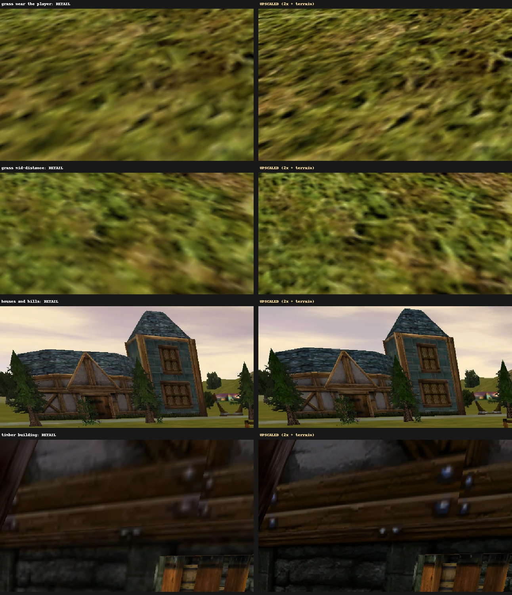

# AC texture upscale

**An HD texture upgrade for Asheron's Call that stays end-of-retail compatible.**

Emulator servers have shipped custom dat files before, but then their players have to swap back to the
end-of-retail dats to join any other server. So most servers stick to end-of-retail dats, and AC's graphics
have stayed frozen.

This pack upgrades the textures and changes nothing else that a server can see. The dat version numbers and all
gameplay data are identical to end of retail, so every end-of-retail server sees a normal retail client.
**Install it once and play on any end-of-retail server.** It's entirely client-side, so there's nothing for
server admins to do and nothing for players to maintain. You can switch back to retail in a second.

This repo holds the tools that build it: Real-ESRGAN upscaling on GPU workers, re-encoding to the game's
formats, and rebuilding the dats.

**Release v1** ([docs/RELEASE.md](docs/RELEASE.md)): every texture on 3D models plus the outdoor ground at 2x,
with 2x terrain blend masks and a 2048 px terrain tile. `client_portal.dat` is 1.65 GB and `client_highres.dat`
is 0.48 GB, both under the 2 GB per-file limit. Tested on a local ACE server and on prod, and shipped as a zip
with an installer and an instant HD/retail switch ([`release/`](release)).

**Download v1:** [GitHub release](https://github.com/osteth/ac-texture-upscale/releases/tag/v1.0) ·
[MEGA mirror](https://mega.nz/file/wWcWALwD#oEX9MdL-N0b4nb1Q0TsoDfhxf5e54pmy0ePjl9334T4) (819 MB) ·
**AC-HD site:** [osteth.github.io/ac-texture-upscale](https://osteth.github.io/ac-texture-upscale/)

## Before / after

Same spot, same camera, retail on the left and v1 on the right. The
[AC-HD site](https://osteth.github.io/ac-texture-upscale/) has drag-to-compare screenshots, and the
[texture bench](https://osteth.github.io/ac-texture-upscale/bench.html) compares 40 textures model by model.

**Starter dungeon:** framed map, rug, stone floor, bookcase, wall trim



<details>
<summary><b>Town Network:</b> barrel, portal, brick, armor, cobblestones</summary>


</details>

<details>
<summary><b>Desert town:</b> armored NPC and forge, fountain, adobe buildings, ground</summary>


</details>

<details>
<summary><b>Out hunting:</b> tree bark and a pack of drudges</summary>


</details>

<details>
<summary><b>Outdoors:</b> grass near and far, distant houses, a timber building</summary>


</details>

## About

See [docs/LESSONS-LEARNED.md](docs/LESSONS-LEARNED.md) for what we found along the way: the 2 GB dat limit, the
terrain crash chain traced through the 2013 PDB, the upscaler's color drift and the back-projection fix, and the
worker queue.

> The tools and docs are code only; game data is never committed (`.gitignore` blocks dat files, extracted
> textures and encoded output). The screenshots and sample crops in `docs/img` illustrate the results. The
> texture pack itself is distributed as a release download.

## How it works

```
 laptop (Windows, owns the game files)            GPU workers (Ubuntu, 2 machines)    
 ------------------------------------             ------------------------------------
 1. fullmanifest  - list 3D textures
 2. extract       - decode to PNG + palette
                    sidecars (.idx/.pal)
 3. queue_jobs.py - batches into a synced  --->   4. upscale_worker.py
                    folder (READY last)                Real-ESRGAN x4plus (4x)
                                                       texextract encode: Lanczos to 2x,
                                                       re-encode to game formats -> .bin
 6. todxt         - uncompressed -> DXT    <---   5. .bin files back (COMPLETE last);
 7. compact       - rebuild portal/highres            4x PNGs stay on the worker's disk
                    from scratch
 8. verifydat     - check against retail
 9. swap-dats.ps1 - swap into the install
```

The job queue is a MEGA-synced folder: `jobs/batch_NNNNN/` from the laptop, `done/<worker>/batch_NNNNN/` from
each worker. Batches are split by number (even/odd), so the two workers never write to the same place.
Worker setup is in [docs/WORKER-SETUP.md](docs/WORKER-SETUP.md).

## Layout

| Path | What |
|---|---|
| `texextract/` | C# (.NET 8) tool that reads and writes dats via Chorizite.DatReaderWriter |
| `worker/` | `upscale_worker.py` (stdlib only) and `setup_worker.sh` for the Ubuntu GPU machines |
| `scripts/` | `queue_jobs.py` (queue batches), `backproject.py` (color-drift fix), `drift.py` (measure color shift vs retail), `finalize.py`, `contact_sheet.py`, `compare.py`, `viewer_assets.py` |
| `scripts/re/` | Crash-site tools: disassembler wrapper and a minimal PDB reader to name client functions |
| `swap/` | Developer swap: `swap-dats.ps1` plus `.bat` files to swap dev/retail dats in place, verifying retail |
| `release/` | Player kit: `hdtex.ps1` (install / hd / retail / status / uninstall), `.bat` buttons, README, checksums |
| `docs/` | Lessons learned, release recipe, worker setup |

## texextract commands

```
texextract fullmanifest <datDir> <out.tsv>                      every 3D texture in an encodable format
texextract collect <datDir> <landblockHex> <ids.txt> <out.tsv>  every texture in one landblock (+ extra setups)
texextract extract <datDir> <manifest.tsv> <outDir>             decode to PNG; INDEX16 also gets .idx/.pal
texextract encode <jobDir> <upscaledDir> <outDir> <scale>       (worker) resize, back-project, re-encode to .bin
texextract todxt <manifest.tsv> <binDir> <outBinDir> <out.tsv>  R8G8B8/A8R8G8B8 -> DXT1/DXT5
texextract compact <datDir> <manifest.tsv> <binDir[;binDir2...]> <outDir> [scale]   rebuild portal/highres compactly
texextract verifydat <retail.dat> <new.dat> [manifest.tsv]      header + every entry vs retail
texextract packbins <datDir> <manifest.tsv> <binDir> <outDir> [scale]  in-place pack (small sets only)
texextract terrainids <datDir> <out.txt>                        textures reachable from the Region (CPU-blended)
texextract masks2x <datDir> <outBinDir> <rows.tsv>              terrain blend masks (LSCAPE_ALPHA) at 2x
texextract setbasetex <client_portal.dat> <size>                Region TexMerge.BaseTexSize (2048 for 2x terrain)
texextract dumpregion <datDir>                                  print the Region's scalar settings
texextract classify | whereused | sample | stats | probe        analysis helpers
```

Build locally: `dotnet build -c Release texextract`. For the workers, publish self-contained:
`dotnet publish texextract -c Release -r linux-x64 --self-contained -p:PublishSingleFile=true`.

## Full run, end to end

```powershell
texextract fullmanifest C:\...\dats work\full_manifest.tsv
texextract extract C:\...\dats work\full_manifest.tsv work\full\src
python scripts\queue_jobs.py work\full\src <MEGA>\upscale full-3d-v1 --size 100 --manifest work\full_manifest.tsv
# ...workers run; copy done\*\batch_*\*.bin into work\full\bins...
texextract todxt work\full_manifest.tsv work\full\bins work\full\bins_dxt work\full_manifest_dxt.tsv
texextract compact C:\...\dats work\full_manifest_dxt.tsv work\full\bins_dxt work\dats_full2x
texextract verifydat C:\...\dats\client_portal.dat work\dats_full2x\client_portal.dat work\full_manifest_dxt.tsv
```

Then copy the two dats into the swap script's dev set and run `swap\Swap To Dev Dats.bat` (game closed).

## Known limits

- **2 GB per dat file:** full 4x would need about 7 GB for portal. 4x is possible only for chosen subsets.
- **Terrain needs its own steps:** uncompressed 2x ground textures, 2x masks, and `BaseTexSize` 2048 (see
  RELEASE.md). `fullmanifest` skips Region-referenced textures for that reason.
- **Excluded for now:** UI/icons (drawn at pixel size).
- **Palettized (INDEX16) textures** stay palettized so armor dyes and creature color variants keep working.
- **Paths:** `texextract` takes the dat folder as an argument (or `AC_DATS`, default `./dats`); `swap-dats.ps1`
  takes `-AcPath` and `AC_DATSETS`; the `scripts/re` tools take `AC_PDB` / `AC_EXE2013`. The game folder defaults to
  `C:\Turbine\Asheron's Call` everywhere.

## Third-party

[Chorizite.DatReaderWriter](https://www.nuget.org/packages/Chorizite.DatReaderWriter),
[BCnEncoder.Net](https://github.com/Nominom/BCnEncoder.NET) (MIT),
[StbImageSharp / StbImageWriteSharp](https://github.com/StbSharp) (public domain),
[Real-ESRGAN ncnn-vulkan](https://github.com/xinntao/Real-ESRGAN) (BSD-3-Clause).
Asheron's Call game data is not included and must not be committed.
